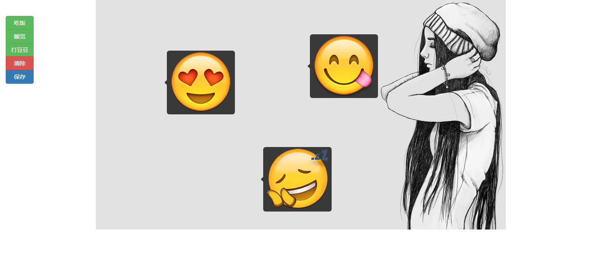

# 图片贴纸插件

一款仿手机相册图片编辑功能里面的“贴纸”功能，能够在一张背景图片上添加任意贴纸功能

## 项目依赖

该插件依赖于[jquery.image-label.js]('https://github.com/ekoz/jquery.image-label.js/blob/master/README.md') 图片标签插件，用于描述图片中的特征事物，主要应用场景是图像识别后的特征展示。

## 用法：

该项目是基于`jquery.image-label.js`来自定义开发，用法和`jquery.image-label.js`保持一致，只需要额外添加自定义方法和属性。参考：[jquery.image-label.js]('https://github.com/ekoz/jquery.image-label.js/blob/master/README.md')的用法。

## 演示：

了解更多详情[点击这里](https://github.com/Run2948/YS.Stickers/index.html)

### 日常备忘笔记：上传本地项目到 Git

* 1、初始化仓库 git init
* 2、添加文件目录到git仓库 git add . (. 是全部文件，文件名 可指定文件)
* 3、上传到git仓库命令 git commit -m "可写注释内容"
* 4、连接远程仓库连接命令 git remote add origin `https://github.com/你的github的用户名/test.git`（这里是版本库URL）
* 5、推送到分支(master)的命令 git push -u origin master（分支名字master为主分支）
